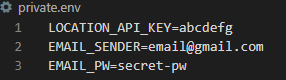
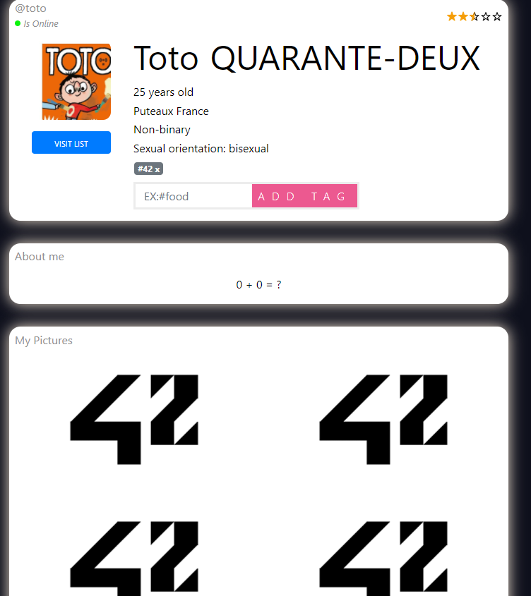

# **42 MATCHA**

This project is about creating a client side rendering dating website.

This project was made with [@ratin](https://github.com/ratin42) who worked on the frontend,
 while I've been focusing on the backend.

 

## **TECHNOS**

- Frontend using **React JS**
    - **React-router** and functional component with **React hooks**.
    - API data is fetched using **axios** and stocked in a **Redux** store.
- Backend using **Golang**
    - API with **Gin Web Framework** package.
    - Websocket for the live messaging system with **Gorilla WebSocket** package and with the wonderful go routines.
    - **JWT** for authentification with 1 short-lived Access token and 1 Refresh token to obtain renewed access token.
- Database with **mySQL**

 

Each of these are containerized using **docker-compose**.

 

### **Documentation**

[API](Server/api/README.md)
 
[WEBSOCKET](Server/websocket/README.md)

 

## **DEPLOYMENT**

 

1. First you need to fill the missing sensitive data in the ``private.env`` file:
    - [Create an API key for the location API we've used](https://ipstack.com/signup/free)
    - Set your gmail address and password and [activate less secured app access](https://myaccount.google.com/lesssecureapps)
    
     

    ``private.env`` file should look like this:

    

     
     

2. Run and start:
    - **``docker-compose up``** &rarr; http://localhost:3000/

 

## **MAIN FEATURES**

 

- Create an account that requires an email validation.
- Create a suggestion list for each users based on their gender, gender preference, age preference, location, common interests.
- Filter or Order the suggestion list based on the ratings, distance, age and common interests.
- If two users like each others, it's a match, they now have access to a private live chat !
- Users can block and rate other profiles.
- Live notifications.

 

## **PREVIEW**

 

